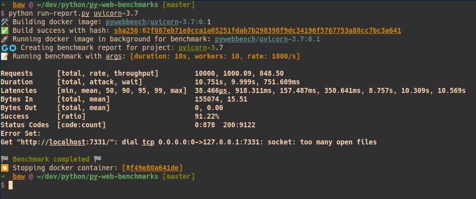

# Python benchmarks 🐍

The purpose of this project is to benchmark the findings of the different WSGI / ASGI python server & framework combinations available at this time.

Its difficult to actually have a `best` implementation since there are so many permutations available with linux distos in docker, wsgi servers, and the server frameworks. For the sake of this benchmark I have tried to scope it to number of requests. The details are shown below (this is the same as benchmark-report.md).

I plan on re-running these once I get a python script to orchestrate it. It would be fun to make some new versions of these projects / dockerfiles since this benchmark is from __2020__ and using `python 3.7`...

Output is generated in the [`/benchmark-reports`](/benchmark-reports) through the `run-report.py` script

## Usage

The `run-report.py` script outputs the containerized benchmark through a python script. Additionally it downloads the benchmarking tool for my linux distro

Here is an example of running the benchmark for the [/uvicorn-3.7](/uvicorn-3.7) project:
> `python run-report.py uvicorn-3.7/`

`run-report.py` works with only the standard lib. It is able to print basic checkpoints (with emoji support!). I still need to include the generation to run through the whole suite of projects and generate a markdown file

## Python Benchmark Results

### Specs

		Kernel: 5.19.0-40-generic
		CPU: Intel i7-9750H (12) @ 4.500GHz
		Memory: 30.96GiB

### Benchmarked with the vegeta Golang HTTP Benchmarking library 
> https://github.com/tsenart/vegeta

 

#### Raw Project Benchmark Results

##### results from bjoern-hug-3.7 benchmark :: FIXME

##### bjoern-3.7 benchmark

`echo 'GET http://localhost:7331/' | vegeta attack -duration=10s -workers=10 -rate=2500/s | tee results.bin | vegeta report`

Requests      [total, rate, throughput]         25000, 2500.08, 2500.05
Duration      [total, attack, wait]             10s, 10s, 143.489µs
Latencies     [min, mean, 50, 90, 95, 99, max]  92.528µs, 1.739ms, 165.896µs, 245.504µs, 285.568µs, 71.213ms, 151.986ms
Bytes In      [total, mean]                     675000, 27.00
Bytes Out     [total, mean]                     0, 0.00
Success       [ratio]                           100.00%
Status Codes  [code:count]                      200:25000  
Error Set:

##### cherrypy-3.7 benchmark

`echo 'GET http://localhost:7331/' | vegeta attack -duration=10s -workers=10 -rate=2500/s | tee results.bin | vegeta report`

Requests      [total, rate, throughput]         25000, 2500.14, 1092.64
Duration      [total, attack, wait]             18.024s, 9.999s, 8.025s
Latencies     [min, mean, 50, 90, 95, 99, max]  27.436µs, 440.431ms, 7.093ms, 1.484s, 2.509s, 7.251s, 15.548s
Bytes In      [total, mean]                     236328, 9.45
Bytes Out     [total, mean]                     0, 0.00
Success       [ratio]                           78.78%
Status Codes  [code:count]                      0:5306  200:19694  
Error Set:
Get "http://localhost:7331/": dial tcp 0.0.0.0:0->127.0.0.1:7331: socket: too many open files

##### gunicorn-3.7 benchmark

`echo 'GET http://localhost:7331/' | vegeta attack -duration=10s -workers=10 -rate=2500/s | tee results.bin | vegeta report`

Requests      [total, rate, throughput]         25000, 2500.14, 2499.21
Duration      [total, attack, wait]             10.003s, 9.999s, 3.736ms
Latencies     [min, mean, 50, 90, 95, 99, max]  563.135µs, 4.519ms, 3.437ms, 6.136ms, 7.494ms, 53.812ms, 160.226ms
Bytes In      [total, mean]                     200000, 8.00
Bytes Out     [total, mean]                     0, 0.00
Success       [ratio]                           100.00%
Status Codes  [code:count]                      200:25000  
Error Set:

##### uvicorn-3.7 benchmark

`echo 'GET http://localhost:7331/' | vegeta attack -duration=20s -workers=10 -rate=5000/s | tee results.bin | vegeta report`

	Requests      [total, rate, throughput]         100000, 5000.04, 1159.34
	Duration      [total, attack, wait]             25.918s, 20s, 5.918s
	Latencies     [min, mean, 50, 90, 95, 99, max]  20.7µs, 2.706s, 44.967µs, 19.266s, 22.287s, 25.084s, 25.891s
	Bytes In      [total, mean]                     510816, 5.11
	Bytes Out     [total, mean]                     0, 0.00
	Success       [ratio]                           30.05%
	Status Codes  [code:count]                      0:69952  200:30048  
	Error Set:
	Get "http://localhost:7331/": dial tcp 0.0.0.0:0->127.0.0.1:7331: socket: too many open files
	

### Resources

##### uvicorn-3.7 Dockerfile source: 
> https://github.com/tiangolo/uvicorn-gunicorn-docker/blob/master/python3.7-alpine3.8/Dockerfile
